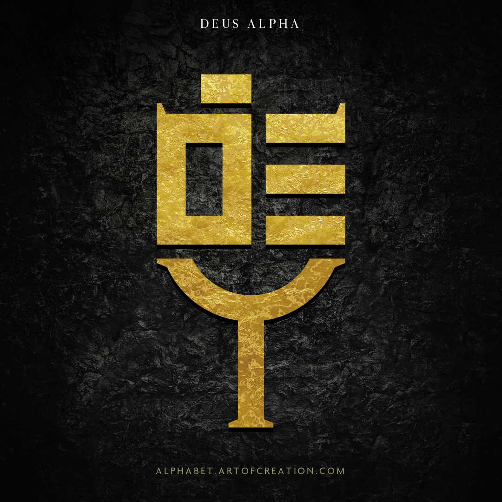

<h1 align="center">Art Of Hunting</h1>

未知的漏洞存在于我们的想象中，直到它被安全的艺术所塑造                                .

[![codecov][codecov-image]][codecov-url]

[codecov-image]: https://img.shields.io/codecov/c/github/ant-design/ant-design/master.svg?style=flat-square
[codecov-url]: https://codecov.io/gh/ant-design/ant-design/branch/master

简体中文 | [English](./README-en_US.md)

## ✨ 文章

- 🌍 <a href="https://mp.weixin.qq.com/s/LvwXfCydgLnt34C6DQMu5Q" target="_blank">[AOH 000] 介绍</a>

  > Djerryz | 2021/4/26

- 🛡  <a href="https://mp.weixin.qq.com/s/sdz27fOoCtH7OJQg7SbN2w" target="_blank">[AOH 001] 从execa到npm命令注入</a>

  >Djerryz | 2021/4/27

- 🛡  <a href="https://mp.weixin.qq.com/s/gerUBw3v86sxSnwpjcX1BQ" target="_blank">[AOH 002] (预告)利用微信机制实现高级拒绝服务攻击</a>

  >Djerryz | 2021/4/30

- 🛡  <a href="https://mp.weixin.qq.com/s/Ebcd-2iTvJz2bfnhlmw2Hw" target="_blank">[AOH 002] 利用微信机制实现"高级"拒绝服务攻击]</a>

  > Djerryz | 2021/5/26

- 🛡   <a href="https://mp.weixin.qq.com/s/xhuVi2YpxfQ8xXlfzJ4ENg" target="_blank">[AOH 003] 自建DNS实现对域名信息收集的降维打击</a>

  > Djerryz | 2021/6/15
  >
  > 通过自建DNS服务器，实现通过根域名，子域名，IP查询到对应关联数据的接口，实现信息收集的拓展。
